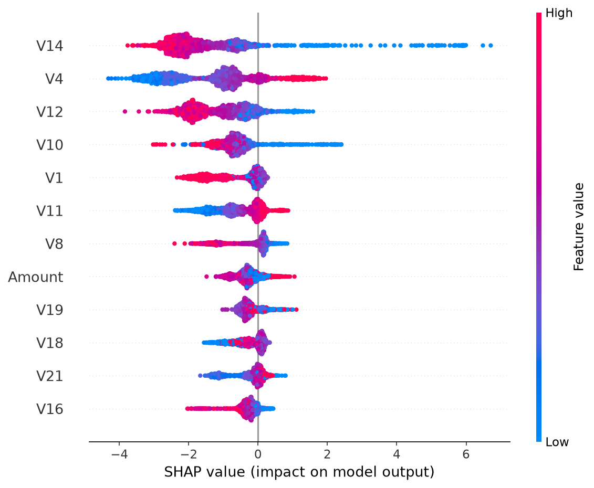
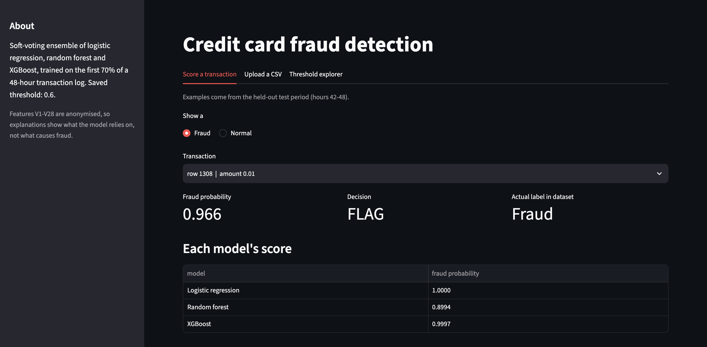
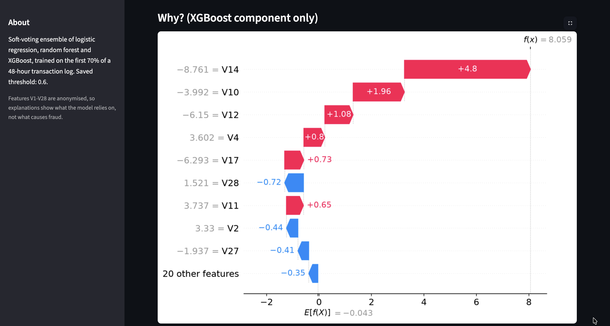
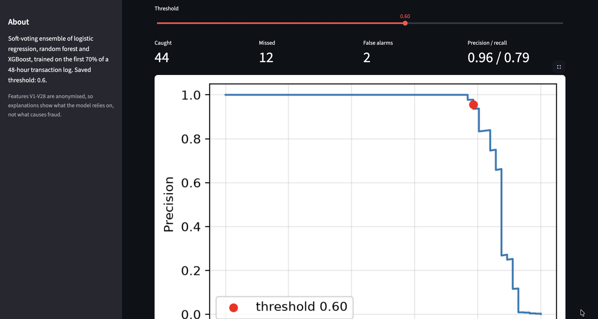

# Credit Card Fraud Detection

An ensemble model (logistic regression, random forest, XGBoost) that scores credit card transactions for fraud, served through a FastAPI endpoint. Built step by step as a learning project.

## Data

[Kaggle ULB credit card fraud dataset](https://www.kaggle.com/datasets/mlg-ulb/creditcardfraud): 284,807 transactions over 48 hours, 492 frauds (0.17%). Features V1-V28 are anonymised PCA components, plus Time and Amount. The CSV is not included in this repo.

## Method

- **Chronological split**: first 70% of time for training, next 15% for validation, last 15% for testing. A random split would let the model train on transactions from the same hours it is tested on.
- **Features**: Time dropped (test times fall outside the training range), Amount transformed with log1p.
- **Imbalance**: handled with class weights (`class_weight`, `scale_pos_weight`), no resampling.
- **Model**: soft-voting ensemble, the average fraud probability of the three models.
- **Threshold**: 0.6, chosen on the validation set from a plateau in the precision/recall trade-off, then fixed before the test set was touched.
- **Metric**: PR-AUC and precision/recall at the threshold. Accuracy and ROC-AUC are misleading at a 0.17% fraud rate.

| Split | Rows | Frauds | Fraud rate |
|---|---|---|---|
| Train | 199,364 | 384 | 0.19% |
| Validation | 42,721 | 56 | 0.13% |
| Test | 42,722 | 52 | 0.12% |

## Results

Validation PR-AUC (random guessing scores about 0.0013):

| Model | PR-AUC |
|---|---|
| Logistic regression | 0.819 |
| XGBoost | 0.847 |
| Ensemble | 0.869 |
| Random forest | 0.879 |

The ensemble did not beat the best single model, and the gaps are within noise with only 56 validation frauds. I kept the ensemble as the final model, decided before looking at the test set.

**Test set, evaluated once** (threshold 0.6):

| Metric | Value |
|---|---|
| PR-AUC | 0.769 (random guessing: 0.0012) |
| Precision | 0.765 |
| Recall | 0.750 |
| Caught / missed / false alarms | 39 / 13 / 12 |

Test results are worse than validation because the threshold and model were selected on validation. With only 52 test frauds, one case moves recall by about 2 percentage points, so treat these as rough estimates.

## Explainability

SHAP values for the XGBoost component (not the whole ensemble) show V14, V4, V12, V10 and V11 as the main drivers. The features are anonymised, so this shows what the model relies on, not what causes fraud.

## Dashboard

A Streamlit app to score single transactions with a SHAP explanation, score an uploaded CSV, and explore the precision/recall trade-off at different thresholds (validation data only, so the test set is never used to tune anything).

    streamlit run src/dashboard.py

It needs `data/creditcard.csv` and the trained `models/ensemble.joblib` locally.

## Limitations

- Only 48 hours of data from one period, with a drifting fraud rate.
- Small number of frauds in validation and test, so metrics are noisy.
- The threshold reflects an arbitrary balance between missed fraud and false alarms. A real deployment would set it from actual costs.
- No monitoring yet.

## Run it

    python3 -m venv .venv && source .venv/bin/activate
    pip install -r requirements.txt
    # put creditcard.csv in data/, then run the notebook to train and save models/ensemble.joblib
    jupyter lab
    uvicorn src.api:app --reload
    python -m pytest -v

Or run it in Docker (the trained `models/ensemble.joblib` must exist locally, as it is copied into the image):

    docker build -t fraud-api .
    docker run --rm -p 8000:8000 fraud-api

Example request:

    curl -X POST http://127.0.0.1:8000/predict -H "Content-Type: application/json" -d @tests/sample_fraud.json

## Structure

    src/split.py      chronological split
    src/features.py   shared feature preparation (training and API)
    src/ensemble.py   soft-voting helper
    src/api.py        FastAPI service
    src/dashboard.py  Streamlit dashboard
    Dockerfile        container image for the API
    tests/            unit and API tests
    notebooks/        exploration, training, evaluation, SHAP
